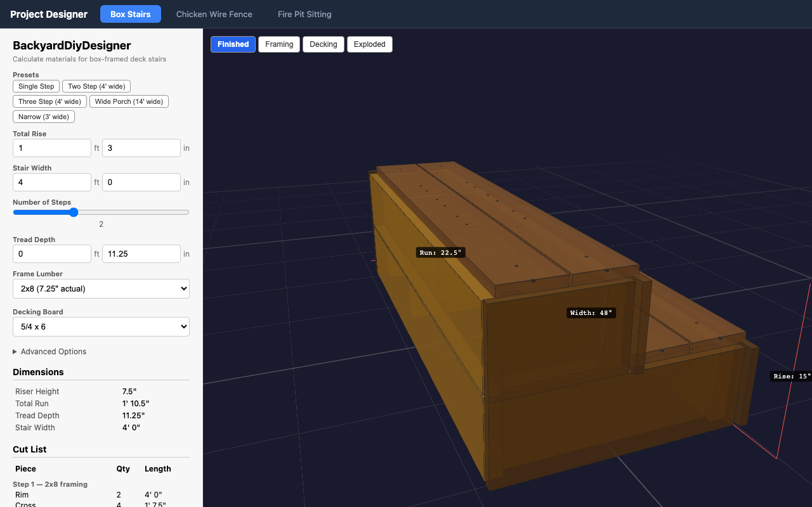
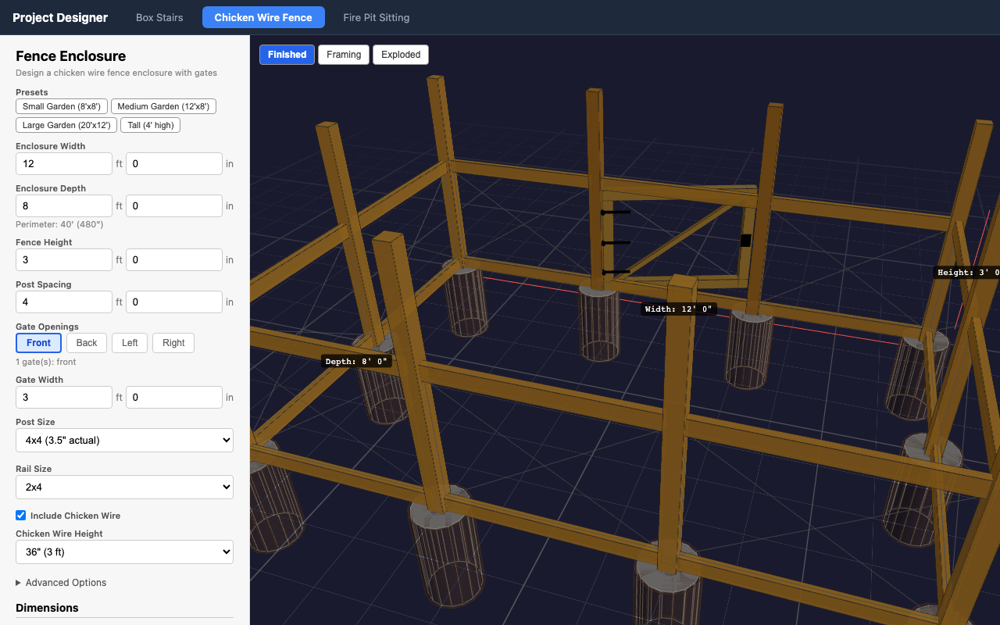
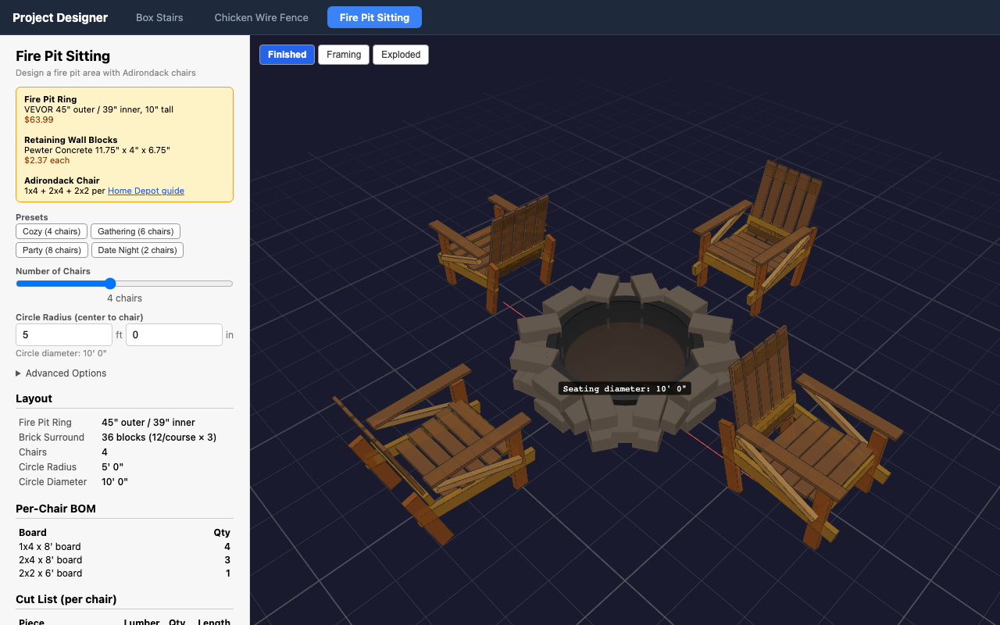

# BackyardDiyDesigner

A 3D backyard project designer for planning and calculating materials for common DIY builds.

### Box Stairs



### Chicken Wire Fence



### Fire Pit Sitting



## Installation

```bash
pnpm install
```

## Running Locally

```bash
pnpm run dev
```

Then open [http://localhost:5173](http://localhost:5173) in your browser.
